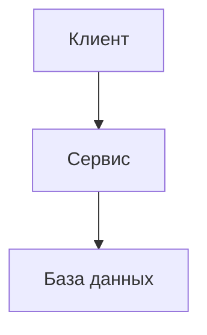
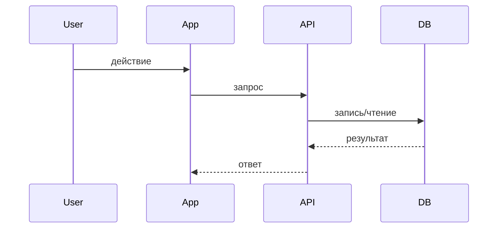

# Шаблон плана реализации

## Метаданные

- Идентификатор фичи:
- Название фичи:
- Статус: Черновик | Утверждён | В работе | Завершён
- Основан на спецификации:
- Связанные контракты:
- Последнее обновление:

## 1. Краткое описание скоупа

Кратко опишите, что именно будет реализовано и что осознанно остаётся вне реализации.

## 2. Прослеживаемость к спецификации

Покажите, как основные части плана отвечают на результаты и ограничения из спецификации.

| Элемент спецификации | Ответ в плане | Примечание |
|---|---|---|
| Результат / ограничение | Компонент / изменение | |

## 3. Архитектурные изменения

Опишите, какие модули, сервисы, границы или слои изменяются.

## 4. Диаграмма компонентов

Добавьте Mermaid-диаграмму компонентов или потоков.

## 5. Поток данных и последовательность

Добавьте Mermaid sequence diagram для критического сценария.

## 6. Технологические решения

Для каждого ключевого выбора укажите решение, обоснование и отвергнутые альтернативы.

- Решение:
  - Обоснование:
  - Отклонённые альтернативы:
  - Последствие:

## 7. Изменения модели данных, базы и схем

Зафиксируйте новые сущности, таблицы, коллекции, индексы, миграции или изменения схем.

- Изменение:
  - Влияние:
  - Примечание по миграции или rollout:

## 8. Точки интеграции

Опишите upstream- и downstream-зависимости и связанные последствия для контрактов.

- Интеграция:
  - Интерфейс:
  - Режим отказа:
  - Fallback-поведение:

## 9. Риски и меры снижения

Перечислите технические, организационные и эксплуатационные риски.

- Риск:
  - Вероятность:
  - Влияние:
  - Митигирующее действие:

## 10. Нефункциональные требования

Опишите требования к производительности, безопасности, надёжности, сопровождаемости и наблюдаемости.

- Производительность:
- Безопасность:
- Надёжность:
- Наблюдаемость:
- Сопровождаемость:

## 11. Стратегия тестирования

Опишите, как будет подтверждаться корректность реализации.

- unit-тесты:
- integration-тесты:
- contract-тесты:
- end-to-end тесты:
- ручная проверка:

## 12. Вывод в эксплуатацию и откат

Зафиксируйте последовательность релиза, feature flags, миграции, мониторинг и стратегию отката.

- план вывода:
- триггер отката:
- шаги отката:
- post-release проверки:

## 13. Контрольный список готовности плана

- [ ] План прослеживается к замыслу спецификации.
- [ ] Архитектурные изменения описаны явно.
- [ ] Изменения данных видимы.
- [ ] Риски и меры снижения задокументированы.
- [ ] Стратегия тестирования определена.
- [ ] Вывод в эксплуатацию и откат описаны.
