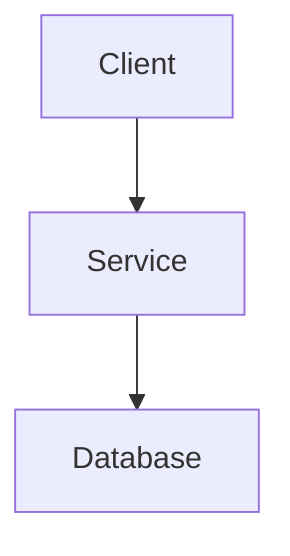
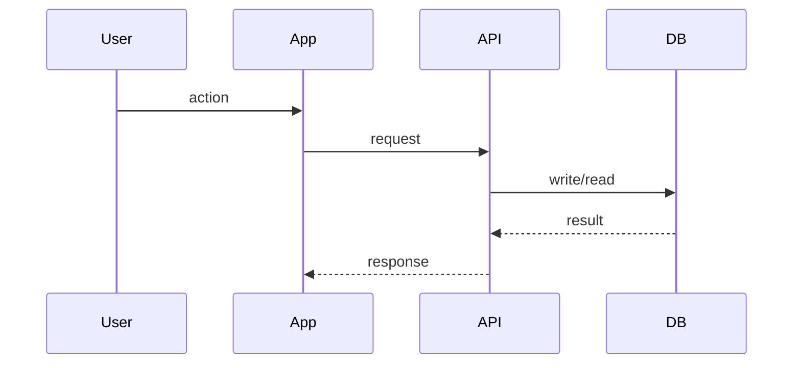

# Implementation Plan Template

## Metadata

- Feature ID:
- Feature name:
- Status: Draft | Approved | In Progress | Completed
- Based on spec:
- Related contracts:
- Last updated:

## 1. Scope summary

Summarize what will be implemented and what remains intentionally excluded.

## 2. Traceability to spec

Map the main parts of the implementation plan back to spec outcomes and constraints.

| Spec item | Plan response | Notes |
|---|---|---|
| Outcome / constraint | Component / change | |

## 3. Architecture changes

Describe which modules, services, boundaries, or layers will change.

## 4. Component diagram

Provide a Mermaid component or flow diagram.

## 5. Data flow and sequence

Provide a Mermaid sequence diagram for the critical path.

## 6. Technology choices

For each key choice include decision, rationale, and rejected alternatives.

- Decision:
  - Rationale:
  - Alternatives rejected:
  - Consequence:

## 7. Data model, database, and schema changes

Document new entities, tables, collections, indexes, migrations, or schema updates.

- Change:
  - Impact:
  - Migration or rollout note:

## 8. Integration points

Document upstream and downstream dependencies and any contract implications.

- Integration:
  - Interface:
  - Failure mode:
  - Fallback behavior:

## 9. Risks and mitigations

List technical, delivery, and operational risks.

- Risk:
  - Likelihood:
  - Impact:
  - Mitigation:

## 10. Non-functional requirements

Document performance, security, resilience, maintainability, and observability requirements.

- Performance:
- Security:
- Reliability:
- Observability:
- Maintainability:

## 11. Testing strategy

Explain how the implementation will be validated.

- unit tests:
- integration tests:
- contract tests:
- end-to-end tests:
- manual verification:

## 12. Rollout and rollback

Document release sequencing, flags, migrations, monitoring, and rollback strategy.

- rollout plan:
- rollback trigger:
- rollback steps:
- post-release checks:

## 13. Plan readiness checklist

- [ ] Plan maps back to spec intent.
- [ ] Architecture changes are explicit.
- [ ] Data changes are visible.
- [ ] Risks and mitigations are documented.
- [ ] Testing strategy exists.
- [ ] Rollout and rollback are defined.
